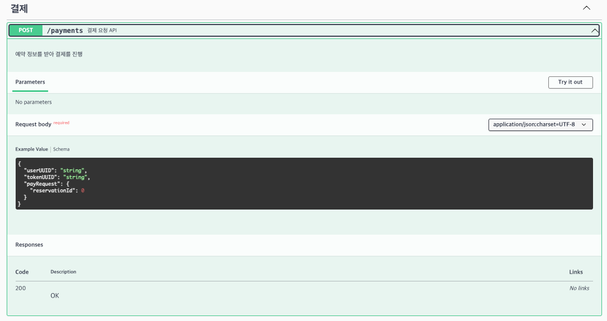

## 프로젝트 보고서

### 프로젝트 문서 링크

- [Milestone](https://thinkable-son-6b5.notion.site/3-Milestone-16f01bed19ff80b1aa1de4e5b42c61b7?pvs=4)
- [요구사항 분석 및 시퀀스 다이어그램](https://thinkable-son-6b5.notion.site/3-16c01bed19ff8060879ad22c3efad6d3?pvs=4)
- [엔티티 및 ERD 설계](https://thinkable-son-6b5.notion.site/3-ERD-16f01bed19ff80f5a545cba81fb8c8dd?pvs=4)

### Swagger

- 결제 요청 API
  

- 대기열 순서 조회 API
  

- 대기열 토큰 발급 API
  

- 대기열 토큰 상태 변경 스케줄러 API
  

- 예약 요청 API
  

- 유저 토큰 발급 API
  

- 잔액 조회 API
  

- 잔액 충전 API
  

- 콘서트 조회 API
  

- 콘서트 일정 조회 API
  

- 콘서트 좌석 조회 API
  

### 패키지 구조

- interfaces
    - controller가 위치한 계층으로 파라미터를 통해 외부 요청을 받고 facadeService를 호출하여 요청을 처리하는 역할
- application
    - facadeService가 위치한 계층으로, 기능별로 하위의 service를 호출하고 그 결과를 조립하는 역할
- domain
    - service와 엔티티 도메인이 위치한 계층으로, 메서드별 하나의 기능에 대한 책임을 가지고 수행하는 역할
- infrastructure
    - DB의 테이블에서 데이터를 퍼올려 매핑하는 역할

### 대기열 관리 방식

대기열 관리 방식은 입장 가능한 토큰의 수를 제한을 두고,
시간이 지나 만료되거나 결제하는 경우 해당 토큰을 비활성화하여
다른 토큰에 진입 기회를 부여

입장 가능한 토큰의 수는 TPS 계산 결과에 따라 80개로 설정

- read 2ms / write 10ms 가정
- 요청별 예상 평균 소요시간 8ms : 1000ms / 8ms = 125 TPS
- 최대 성능 70%를 사용한다고 가정하여 80 ~ 85 TPS 설정

토큰 활성화는 Nifi와 같은 외부 스케줄러를 통해 매 초마다
토큰 활성화 API를 호출한다고 가정하고 구현

토큰 만료는 활성화 후 20분 혹은 결제 성공 시에 만료

### 동시성 관리

시간 상의 문제로 동시성 테스트 코드는 작성하지 못했지만,
아래와 같은 방식으로 동시성을 처리를 의도했습니다.

- 트랜잭션 시작 시 Reservation 테이블 배타 락 지정
- 데이터가 없는 경우 MySQL의 supremum으로 gap lock
- 데이터가 있는 경우 예외 처리

위 supremum을 통한 gap Lock 방식은 이론상으로만 검증하고 실제 테스트 해보지는 못했습니다.

추가적으로 요청의 빠른 처리를 위해 트랜잭션을 facade가 아닌 service에 걸고
결제 요청과 같은 경우에는 보상 트랜잭션 방식을 적용